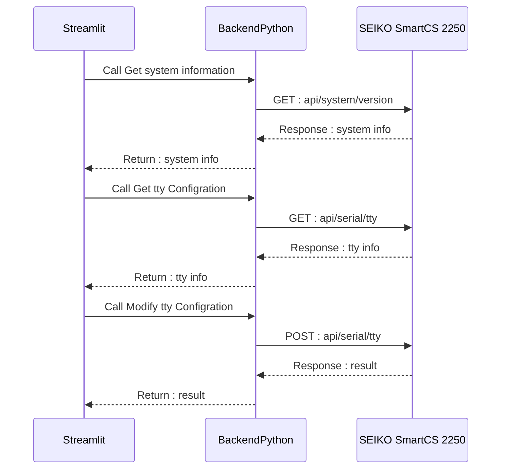

# streamlit-with-ne

StreamlitでNW装置の状態の可視化やInterfaceに対しての何らかの操作を実行する簡易的なWebUIです

JANOG53で発表するLTのために簡易的に用意したデモです。

対象装置はJANOG(JApan Network Operators Group)にちなんで国産の装置を対象にしたかったので、
SEIKO SmartCS 2250を利用させていただきました。



# How to run

Python3.11.1で動作確認をしています。
おそらく3.6以降だったら動きます。

必要なpackageをinstallしてください

```
pip install -r requirements.txt
```

.env.sampleのip,password,user,passwordを指定してください。
以下の情報が必要になります。

- ip : コンソールサーバーのIPアドレス
- port : コンソールサーバーのREST Serverのport(Default80)
- user : RESET API用ユーザー名
- password :  REST API用ユーザーパスワード

```
source .env.sample
```

streamlitを起動します

```
streamlit run app.py
```
